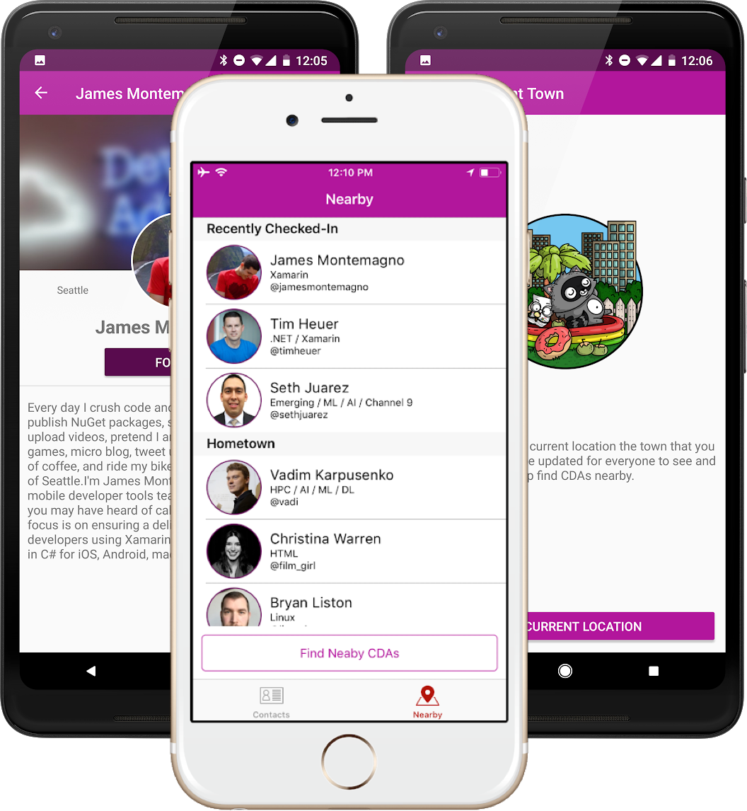

# app-awesome-contactz

Awesome Contactz is a cross-platform mobile contact application sample for iOS, Android, and Windows built with Xamarin.Forms and leverages several services inside of Azure including Azure AD B2C, Functions, and Cosmos DB.

## Mobile App Build Status

|Platform|master|
| ------------------- | :------------------: |
|iOS||
|Android||

### Data
Sample data for this application was imported from the [Microsoft Cloud Developer Advocates](https://developer.microsoft.com/en-us/advocates/) (CDAs). When a CDA logs in (who is part of Azure Active Directory) they are able to update their location anywhere in the world. All users have the ability to skip login and browse our beautiful contact list of CDA and find CDAs that are nearby.

## Smarts
Since CDAs travel often to help developers around the world build amazing things we built into the application a way for CDAs to update their current city/state/country and a way for other CDAs to see who is nearby. This leverages built in capabilities of the devices such as geolocation and also leverages advanced geolocation capabilities of CosmosDB for fast queries.

## Services

### [Azure Active Directory B2C](https://azure.microsoft.com/en-us/services/active-directory-b2c/)
Used directly for all authentication in the app. CDAs can log in and we use this authentication with our Azure Function.

### [Cosmos DB](https://azure.microsoft.com/en-us/services/cosmos-db/)
Our CDAs are located all through the world. We leverage CosmosDB for it's geo-replication to ensure optimal performance in the mobile applications. We also leverage Cosmo sDB advanced queries to get specific data based on the user's geolocation.

### [Azure Functions](https://azure.microsoft.com/en-us/services/functions/)
We use serverless architecture for several features of the application including:

* Updating geolocation data. The CDA will update their location with an Azure Function that will detect their city/state/country and get an annonymous Latitude and Longitude for that location. This ensure privacy so exact location is not stored.
* This then updates Cosmos DB with their new location.

### [Visual Studio App Center](https://appcenter.ms)
Used extensively for Continuous Integration and Deployment, while providing powerful analytics and crash reporting that is imported directly into Application Insights.

## Libraries Used
* [Xamarin.Forms](http://xamarin.com/forms)
* [Settings Plugin](https://github.com/jamesmontemagno/SettingsPlugin)
* [MVVM Helpers](https://github.com/jamesmontemagno/mvvm-helpers)
* [Messaging Plugin](https://github.com/cjlotz/Xamarin.Plugins)
* [Geolocator Plugin](https://github.com/jamesmontemagno/GeolocatorPlugin)
* [Share Plugin](https://github.com/jguertl/SharePlugin)
* [Connectivity Plugin](https://github.com/jamesmontemagno/ConnectivityPlugin)
* [Monkey Cache](https://github.com/jamesmontemagno/monkey-cache)
* [App Center - Build, Distribute, Analytics, Crash](https://appcenter.ms)
* [Multilingual Plugin](https://github.com/CrossGeeks/MultilingualPlugin)
* [Markdig](https://github.com/lunet-io/markdig)
* [Microsoft Identity Client](https://github.com/AzureAD/microsoft-authentication-library-for-dotnet)
* [Azure DocumentDb Core](https://github.com/Azure/azure-documentdb-dotnet)

## Art:
* [Bit by Ashley McNamara](https://github.com/ashleymcnamara/Developer-Advocate-Bit)
* [Cloud Neon Sign by Bryan Liston](https://twitter.com/listonb) with permission

## License
Under MIT (see license file)

